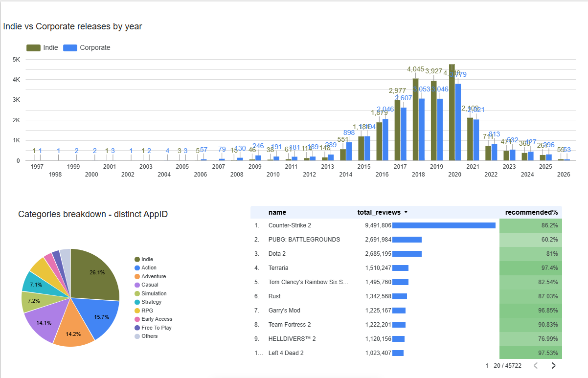
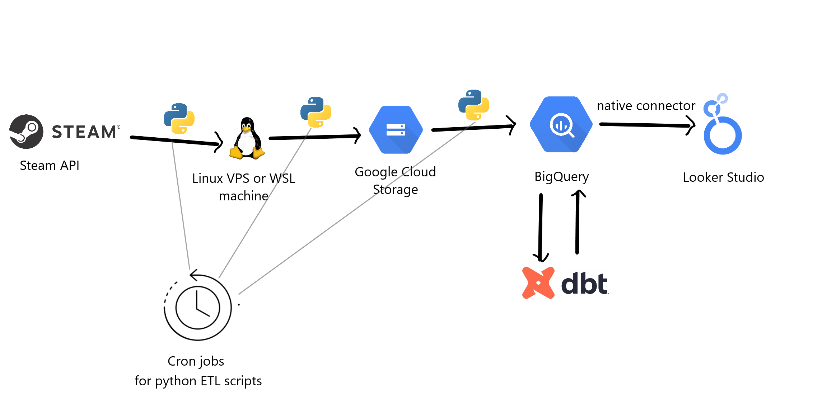
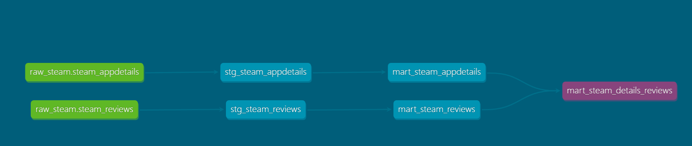

# Steam Games Data Pipeline

A batch data engineering project that ingests Steam game metadata and review summaries, stores raw data in Google Cloud Storage, loads it into BigQuery, transforms it with dbt, and visualizes insights in a dashboard.

---

## Problem description

The Steam platform contains a massive and constantly changing catalog of games, but the raw API data is not structured for analysis.

This project solves the following:

- Collect Steam game catalog data daily
- Enrich new games with detailed metadata
- Retrieve review summary metrics (total, positive, negative reviews)
- Store raw data in a cloud data lake (GCS)
- Load and structure the data in a cloud data warehouse (BigQuery)
- Transform raw data into analytics-ready tables using dbt
- Visualize trends such as genres, releases, and reviews

### Key challenge

Steam’s API endpoints for game details and reviews are rate-limited, making full refreshes inefficient.
With Steam's limitation of 200 requests per 5 minutes, it takes about 10 days to fetch the appdetails and reviews for the whole Steam catalog.
I didn't have time to fetch everything, so the dataset will not be realistic, but the whole pipeline works.

### Solution

If you can fetch the details for the whole catalog (running it for about 10 days), after that you only need to fetch new games, so scripts can run daily.
For the purpose of peer-reviewing, if you'd like to replicate the pipeline, I encourage you to use the sample datasets provided.

This pipeline uses an incremental append-only approach:

- Full catalog is fetched daily
- Details and reviews are fetched only for new appids
- Previously processed appids are skipped
- Failed requests are retried in future runs

This allows the pipeline to scale while respecting API limits.

### Dashboard
[Open Dashboard in Looker Studio](https://lookerstudio.google.com/reporting/bf78e0c8-a795-4070-aeb0-f184cd471ef9)

---

## Architecture

Steam API  
→ ingest_game_list.py → steam_catalog_YYYY-MM-DD.jsonl  
→ ingest_game_details.py (incremental) → steam_appdetails_YYYY-MM-DD.jsonl  
→ ingest_game_reviews.py (incremental) → steam_reviews_YYYY-MM-DD.jsonl  
→ upload_raw_to_gcs.py → Google Cloud Storage  
→ gcs_to_bq.py → BigQuery (raw tables)  
→ dbt → marts → dashboard  

## Technologies

- Python (API requests, loading)
- uv (environment management)
- Google Cloud Storage (lake storage)
- BigQuery (structured data storage)
- dbt (create, transform SQL models)
- cron (scheduling)
- JSONL (raw storage)
- Google Looker Studio (dashboard, visualization)

## Data ingestion

### Steam catalog

This is the endpoint for the  game IDs and names, without any additional information.
This can be fetched very quickly, giving us about 160.000 games at the time of this execution.

Endpoint:
IStoreService/GetAppList

Output:
data/raw/steam_catalog/steam_catalog_YYYY-MM-DD.jsonl

Contains:
- appid
- name

### Steam app details

Games have to be fetched by each ID, consuming 1 request per game.
Contains most of the information about the games, except for reviews.

Endpoint:
/api/appdetails

Output:
data/raw/steam_appdetails/steam_appdetails_YYYY-MM-DD.jsonl

Fields include:
- name
- type
- developers
- publishers
- genres
- price
- release date
- metacritic
- recommendations

### Steam reviews

Games have to be fetched by each ID, consuming 1 request per game.
Contains review information.

Endpoint:
/appreviews/{appid}

Output:
data/raw/steam_reviews/steam_reviews_YYYY-MM-DD.jsonl

Fields include:
- total_reviews
- good_reviews
- bad_reviews
- review_score
- review_score_desc

## Incremental logic

### Behavior

- Catalog is fetched fully every day
- Details and reviews:
  - scan all historical outputs
  - only fetch appids not processed before
- Failed appids are retried later

### Example

Day 1: 160000 apps processed  
Day 2: 160200 apps → only 200 new processed  

### Tradeoff

- Efficient and scalable
- Old data is not automatically refreshed - Still very useful for analyzing year-by-year trends

## Cloud

### Google Cloud Storage (data lake)

Stores raw JSONL files:

data/raw/steam_catalog/  
data/raw/steam_appdetails/  
data/raw/steam_reviews/  

### BigQuery (data warehouse)

Tables:
- raw_steam.steam_catalog
- raw_steam.steam_appdetails
- raw_steam.steam_reviews

## Data warehouse design

### Partitioning

All tables are partitioned by ingestion date.

### Clustering

All tables are clustered by appid.

### Reasoning

- Queries filter by date → partitioning reduces scan cost
- Joins use appid → clustering improves performance

## Transformations (dbt)

### Layers

Staging:
- clean raw data
- extract JSON fields
- standardize schema

Intermediate:
- flatten arrays (genres, categories)
- normalize structure

Marts:
- game-level dataset
- genre distribution
- release trends
- review metrics

## Workflow orchestration

This is a batch pipeline executed with cron.

### Execution order

ingest_game_list.py  
→ ingest_game_details.py + ingest_game_reviews.py  
→ upload_raw_to_gcs.py  
→ gcs_to_bq.py  
→ dbt build  

### Why cron

- simple
- reliable
- sufficient for batch pipelines
- avoids unnecessary Airflow complexity

---

## Reproducibility - How to guide

### 1. Clone repo

git clone <repo-url>  
cd <repo>  

### 2. Setup ingestion environment

uv venv  
source .venv/bin/activate  
uv sync  

### 3. Setup dbt and dbt venv

cd dbt
python -m venv .venv
source .venv/bin/activate
pip install dbt-bigquery

Set up bigquery connector in dbt's profiles.yml

### 4. Configure environment

cp .env.example .env  

Fill in the required fields, self-explanatory

### 5. Run pipeline manually
Optional / not recommended: Start fetching Steam data
- python scripts/ingest_game_list.py
- python scripts/ingest_game_details.py
- python scripts/ingest_game_reviews.py

Recommended - Use sample data:
- rename "sample_data" folder to "data"
- python scripts/upload_raw_to_gcs.py --date 2026-03-28  
- python scripts/gcs_to_bq.py --date 2026-03-28  
cd dbt  
source .venv/bin/activate
dbt build

### 6. Visualize
Connect BigQuery to Looker Studio and start building visuals

## Limitations

- no automatic refresh for old games
- initial backfill is slow due to API limits
- infrastructure is manually configured (no IaC)
- cron does not enforce strict dependencies

## Future improvements

- create robust scheduling
- implement logging
- add dbt tests
- expand dashboard

---

## Author
Viktor Likár
Data Engineering Zoomcamp Project